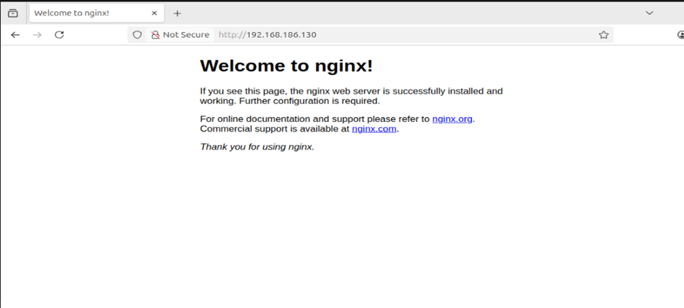

Explored the various types of docker networking through a hands-on lab with docker networks 

1. Host testing - Configuring the container's IP address to identical to the host's IP address

Screenshot showing success in accessing docker image

Drawbacks of Host Testing - Another container on the same machine cannot access the same IP address.

Lab file can be found in the host_lab folder. 

2. Macvlan method
- Each docker container on a physical device can be assigned different MAC addresses as if there are different physical devices.
- Created two containers, pinged the IP address of one container from the other, and enabled the promiscuous mode. 
Lab field can be found in the macvlan_lab folder. 

3. Ipvlan method - L2 Networking Method
- Each docker container can share multiple IP addresses but the same MAC addresses of the container which resolves the issue of binding multiple MAC addresses to a single physical network device. 

4. None method - L3 networking method
- Each docker container can be assigned to a different IP address inside the host where the host routes the network request from an external source to the appropriate IP. Any contaier can be accessed via an external IP through the host. 